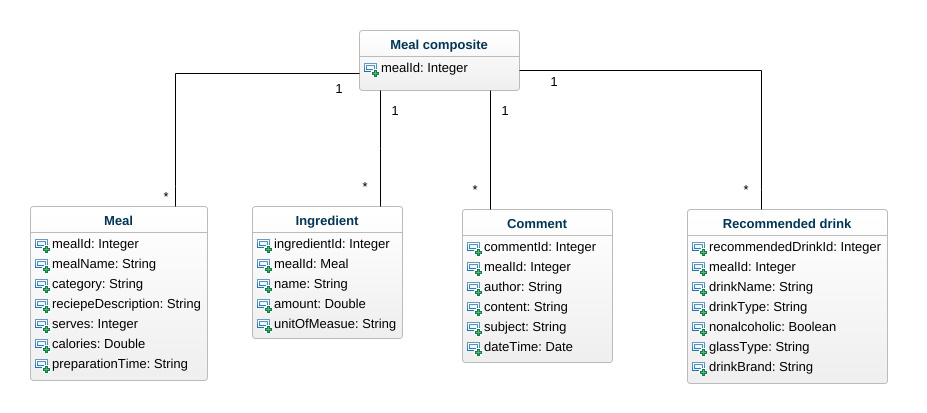
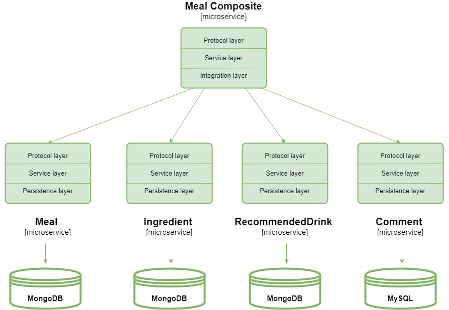
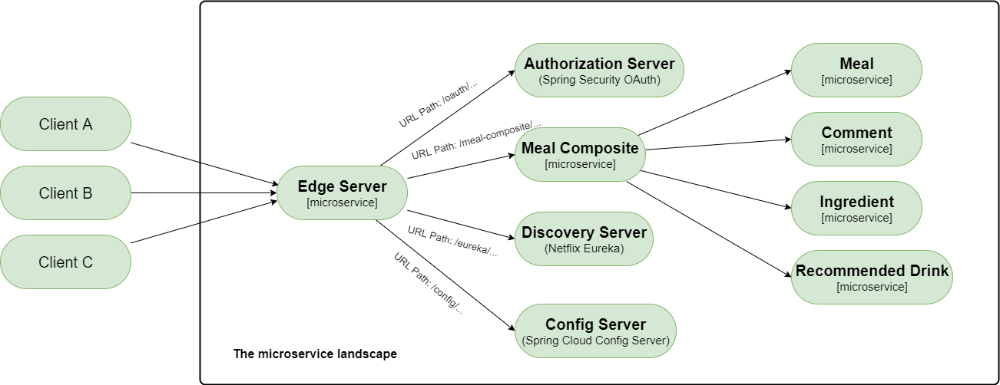

# FoodBlog_Microservices

FoodBlog_Microservices is a meal (recipe) information service. 
It is a microservice architecture, implemented using `Spring Boot` and `Spring Cloud`. Business logic is presented through five microservices, where meal, comment, ingredient and recommended-drink microservices represent core microservices, and meal-composite represents integration of the core four microservices.

## Exam assignment

The microservice system responds to the defined project task. 

A microservice system should:
- be developed using Spring Cloud and contain all the microservice components necessary for the functioning of such a system in production
- each system component is containerized (microservice, database, etc.)
- contains at least 5 microservices related to the application's business logic
- to support different communications (synchronous/asynchronous) according to business logic
- includes unit and integration tests
- the pipeline (build/test/deploy) is clearly defined and configured

## Persistence

Persisting data in various types of databases is enabled  using `Spring Data`. In this project Spring Data is used for one type of NoSQL database - MongoDB, and for one type of traditional relational database - MySQL.
Thre two core concepts in Spring Data are entities and repositories, and they generalize how data is stored and accessed from various types od database.
Each microservice has its own database: 
- Meal - `MongoDB`
- Ingredient - `MongoDB`
- RecommendedDrink - `MongoDB`
- Comment - `MySQL`

The image below shows the class diagram used in the project.



The architecture of microservices used during the development of the project is shown in the picture. All core microservices contain a persistence layer through which communication with the corresponding databases is performed.



Synchronous microservice communication is provided: 
- for CREATE, READ and DELETE operations of meal-composite microservice and
- for READ operations of core microservices.

Asynchronous communication takes place during the CREATE and DELETE operations of the core microservices. The following message systems were used: RabbitMQ and Apache Kafka.

## Microservice landscape



Spring Cloud is used to implement the following design patterns:
- Service discovery,
- Edge server,
- Centralized configuration,
- Circuit breaker and
- Distributed tracing.

| Design pattern            | Spring Cloud Component                         | Description                                                                                                                                                                                          |
|---------------------------|------------------------------------------------|------------------------------------------------------------------------------------------------------------------------------------------------------------------------------------------------------|
| Service discovery         | Netflix Eureka and Spring Cloud load balancer  | Service Discovery service keeps track of currently avaiable microservices and IP addresses of its instances.                                                                                         |
| Edge server               | Spring Cloud Gateway and Spring Security OAuth | Edge server is used to secure a microservice landscape, that is to hide private services from external usage and to protect public services.                                                         |
| Centralized configuration | Spring Cloud Configuration Server              | Centralized configuration provides the centralized management of configuration files. Also, encription of sensitive information in configuration files is supported with Spring Cloud Config.        |
| Circuit breaker           | Resilience4j                                   | Circuit breaker, together with retry mechanism, is used to prevent a chain od failure reactions if a remote service stops to respod and to handle random errors that might happen from time to time. |
| Distributed tracing       | Spring Cloud Sleuth and Zipkin                 | Distributed tracing is user to track and visualize how requests and messages flow between microservices when processiing an external call to the system landscape.                                   |

## Pipeline (build/test)

```./gradlew build && docker-compose build && docker-compose up```

If the microservice landscape is running, it is possible to execute the test script with the command: ```./test-em-all.bash```, 
or if it isn't in running state, you can execute test script with: ```./test-em-all.bash start``` 
